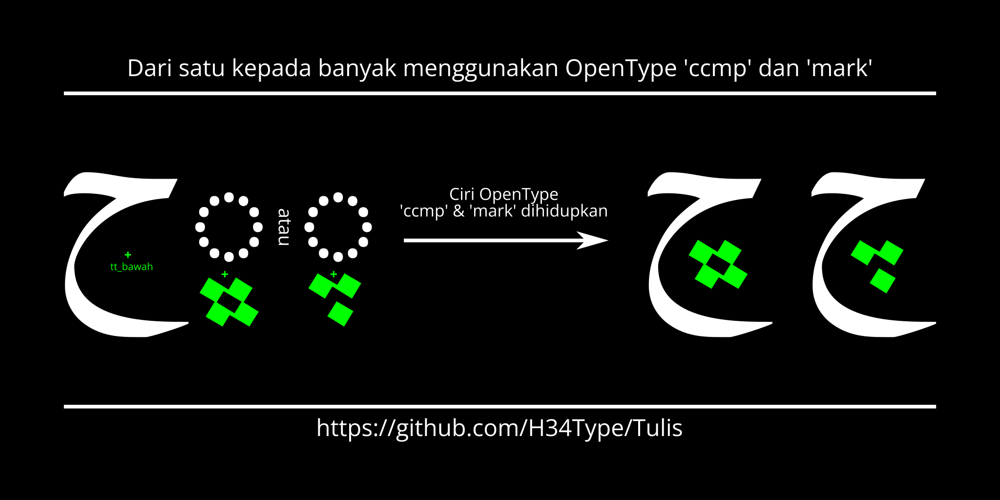

# Hamzah Tiga Suku Tulis
Pasuan naskh kaku yang menumpukan kepada sokongan huruf Melayu Jawi, berasaskan pasuan KacstOffice.

### Ciri-ciri

Pasuan ini menggunakan kaedah yang digunakan pasuan Gulzar dan Reem Kufi, iaitu titik dan huruf adalah berasingan dan bukannya dalam satu bentuk.

Ini menjadikan titik dan tanda pada huruf-huruf Arab itu dinamik dan boleh diubah kedudukannya. Juga membolehkan kita menjana beratus huruf arab yang sama cuma berbeza titik dengan mudah dan fail pasuan yang kecil!

## Keperluan sistem

Pasuan ini bergantung sepenuhnya kepada ciri OpenType, perisian yang tidak menyokong OpenType mungkin tidak dapat memaparkan langsung pasuan ini.

## Menjana pasuan

Pasuan dijana menggunakan fontmake melalui fail ufo3 yang dijana fontforge.
Buat masa ini, pasuan tidak dijana secara automatik oleh *Github Actions*. Silakan ambil salinan di dalam folder `fonts`.

## Bahasa repositori
Bahasa repositori ini utamanya bahasa Melayu, dengan bahasa Inggeris yang lagi akan datang disertakan.

## Rupa susun repositori

Susunan repositori pasuan ini mengikut [Unified Font Repository v0.3](https://github.com/unified-font-repository/Unified-Font-Repository).

## License

Perisian pasuan ini berlesenkan Lesen Pasuan Terbuka SIL (*SIL Open Font License*), versi 1.1.

Sebarang pertanyaan dan kemusykilan boleh dirujuk di https://openfontlicense.org

Pasuan asal KacstOffice adalah berlesenkan GPL, tetapi semua bentuk huruf telah ditiru semula dan segala pengaturan *OpenType* dibuat dari kosong.

Harapnya tiada masalah di masa akan datang.
